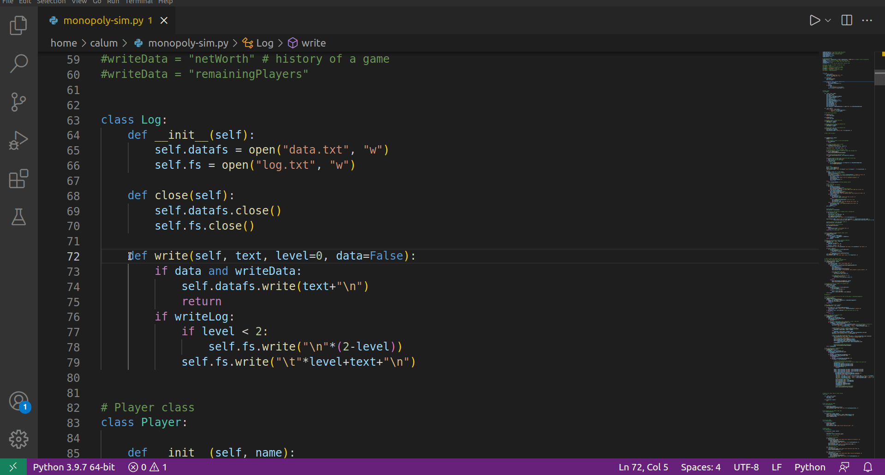

# Trelent - Docstrings on Demand

Documentation sucks. Let us take care of it!

Trelent uses AI to write docstrings for your python functions instantly - just highlight your code and press `Alt (⌥) + d`.

### Command Reference
`Trelent: Write Docstring(s)`: Write docstrings for each function within your selection.

### Keybind Reference
`Trelent: Write Docstring(s)` is bound to `Alt (⌥) + d`.

### Menu Reference
`Write Docstring(s) - Trelent` can be found in the editor context menu when a python snippet is selected.

### Supported Languages
Trelent currently supports Python docstrings. JavaScript TypeScript, Java and C# are on our roadmap.

*We cannot guaruntee accuracy with docstrings we generate. Please review docstrings manually to check for errors.*